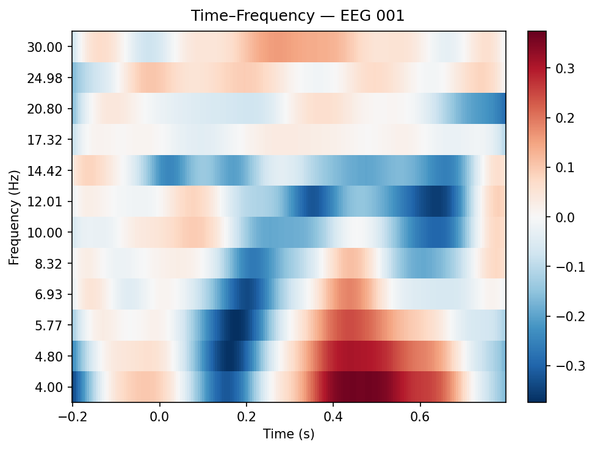

# EEG Time–Frequency (MNE Sample) — Mini Pipeline

Minimal, reproducible EEG time–frequency analysis using the public **MNE sample dataset**.

## What it does
- Loads MNE sample dataset
- Filters EEG (1–40 Hz)
- Epochs an auditory condition
- Computes time–frequency power (Morlet wavelets)
- Saves outputs to `results/`

## Installation
pip install -r requirements.txt

## Run
python src/tfr_mne_sample.py

## Output
- results/time_frequency_eeg.png
- results/run_report.txt

## Example Output

