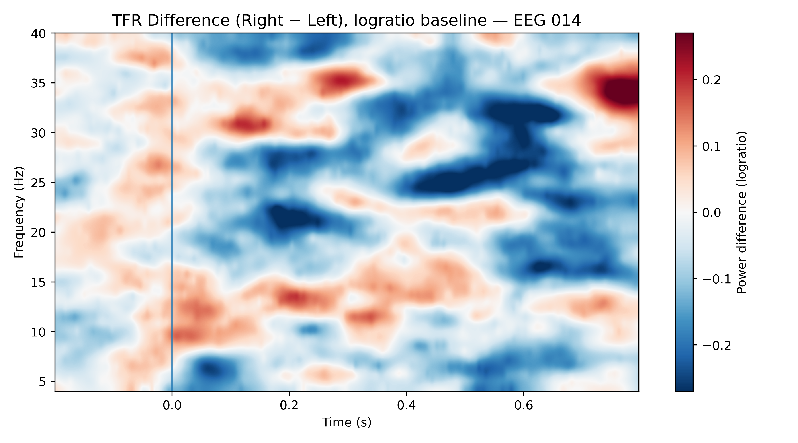

# EEG Time–Frequency (MNE Sample) — Research Mini Pipeline

This repo demonstrates an end-to-end EEG analysis using the public MNE sample dataset:
- ERP (Auditory Left vs Right)
- Morlet time–frequency power (baseline log-ratio)
- Condition difference (Right − Left)
- Cluster-based permutation statistics (TFR)

Run:
python src/tfr_mne_sample.py
python src/erp_and_tfr_figure.py

Outputs:

